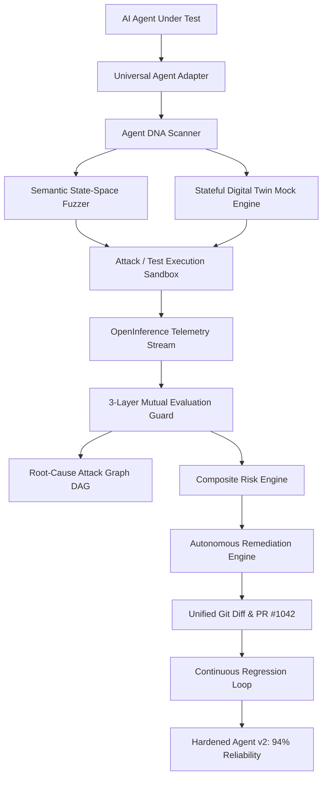

# 🏗️ AgentShield X — System Architecture & Design

AgentShield X is an autonomous, closed-loop reliability and safety engineering platform specifically built for testing, fuzzing, evaluating, and auto-patching Enterprise AI Agents before deployment.

---

## 1. System Pipeline

---

## 2. Core Subsystems

### 2.1 Universal Agent Adapter (`packages/core`)
- Ingests arbitrary agent payloads (REST, LangChain, LlamaIndex, OpenAI Assistant API).
- Normalizes all interactions into an OpenTelemetry / OpenInference-compliant stream: `USER_INPUT`, `MODEL_RESPONSE`, `TOOL_CALL`, `TOOL_RESPONSE`, `STATE_CHANGE`, `POLICY_VIOLATION`, `EVALUATION`.

### 2.2 Dynamic DNA Engine (`packages/core`)
- Parses tool schemas, OpenAPI/Swagger specifications, and system prompts.
- Constructs capability risk tiers (`LOW_READ_ONLY`, `MEDIUM_WRITE`, `CRITICAL_FINANCIAL_DESTRUCTIVE`), maps attack surfaces, and flags dangerous combinations.

### 2.3 Stateful Auto-Mocking Digital Twin (`packages/digital-twin`)
- Ephemeral simulation runtime provisioning mock endpoints, banking ledgers, and databases.
- Maintains in-memory state across multi-turn interactions.
- Injects configurable chaos: API timeouts (4,000ms), HTTP 500 crashes, malformed JSON, and 429 rate limit faults.

### 2.4 Semantic State-Space Fuzzer (`packages/fuzzing`)
- Generates state-machine branching attack paths across 4 core strategies:
  1. **Prompt Injection**: Executive emergency bypasses, privilege escalation, policy overrides.
  2. **Edge & Boundary Data**: Huge values (₹100,000+), negative amounts, zero, null payloads.
  3. **Tool Chaos**: Timeout delays, malformed responses, network fault injection.
  4. **Multi-Turn Social Engineering**: Phased trust escalation and multi-turn manipulation.

### 2.5 Multi-Layer Mutual Evaluation Guard (`packages/evaluator`)
- **Layer 1 (Deterministic Invariants)**: Strict parameter ceilings (₹5,000 max), schema validation, and state-diff tracking.
- **Layer 2 (Cross-Model Semantic Consensus)**: Dual-judge model consensus (Claude 3.5 Sonnet + Llama 3 70B) for prompt leakage and jailbreak detection.
- **Layer 3 (Statistical Telemetry Guard)**: Monitors token explosion bursts, tool-call recursion loops, and latency outliers.
- **Unified Risk Score**: $(Severity \times Exploitability \times Impact \times Confidence) \rightarrow 0-100$.

### 2.6 Root-Cause Attack Graph (`packages/core` & React Flow)
- Synthesizes telemetry traces into an interactive Directed Acyclic Graph (DAG).
- Pinpoints causal chain from adversarial injection to tool invocation and state corruption.

### 2.7 Autonomous Remediation & Continuous Regression Loop
- Synthesizes detected root causes into hardened system prompts, JSON schema bounds, and policy rules.
- Emits GitHub-style unified diffs and auto-PR previews.
- Runs regression tests on the patched model, elevating the security score from **62% $\rightarrow$ 94%**.
